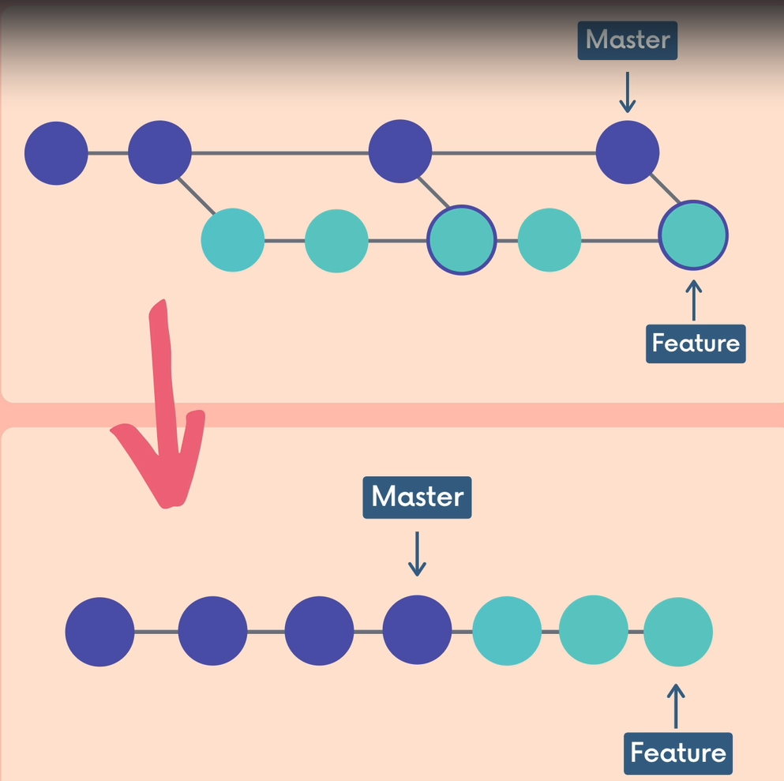

# Git Rebase
Le rebase est une alternative au merge et un outil de nettoyage

Merge : Si j'ai une nouvelle branche partant de main. Une personne ajoute quelque chose de nouveau sur main, alors je peux faire un git merge sur ma branche ce qui va me créer un nouveau commit avec le code venant de main. La commande merge ajoute aussi les commits de la branche main, pas seulement le commit de merge. Les commits de merge ont plusieurs parents alors que grâce au rebase, chaque commit à un seul parent.

Exemple depuis la nouvelle branche : ``git merge main``

Rebase : C'est un autre moyen de combiner des branches. Le rebase permet de réécrire l'historique (ce qui peux poser des problèmes)

**Règles d'or pour le rebase**

*Never rebase commits that have been shared with others. If you have already pushed commits up to Github... DO NOT rebase them unless ou are positive no one on the team is using those commits*

Cette règle est lié au fait que lors d'un rebase, les commits de la branche qui fait le rebase sont effacés pour en créer de nouveaux. Si des personnes ont déjà ces commits, les hash ne seront plus les mêmes et c'est un enfer pour tout rematcher.

